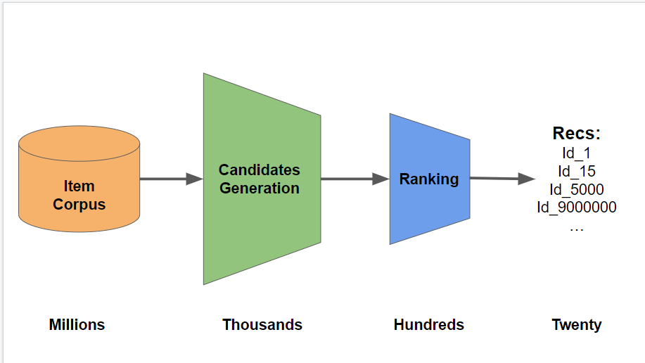

# OTTO_Implement

## Overview

这个项目是对OTTO比赛第三名方案的复现，因为设计到比较多的推荐系统的知识和数据处理的技巧，也可以作为我梳理推荐算法知识的入门方案。

## Structure

### Rerank

这里提到rerank的方法，共有两个Step：

**Step1**：利用用户画像和统计特征以及一些交叉特征

**Step2**：利用物品画像和统计特征

下面的图表示了物品筛选排序的过程：

从这个图片中可以看到首先召回->粗排->精排->结果
